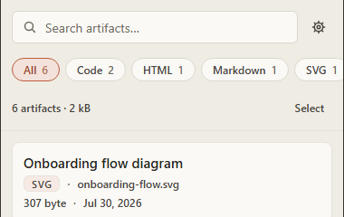
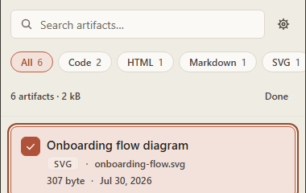
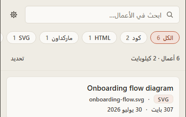

# Abrium

**A local-first Chrome extension that catalogs your Claude Artifacts.** Abrium watches claude.ai in the background and saves every code, document, HTML, SVG and React artifact you generate — searchable, versioned, and stored entirely on your own machine.

[](LICENSE)
[](manifest.json)
[](#languages)
[](#privacy--local-first)

[abrium.onl](https://abrium.onl) · [Report an issue](https://github.com/omaelbaz/abrium-extension/issues)

## What it does

Claude Artifacts disappear the moment you close the conversation or the chat history scrolls past them. Abrium fixes that: it watches the artifact panel on claude.ai, saves a copy of everything you open — including earlier revisions — and gives you a searchable side-panel gallery to find it again later. No account, no server, no sync. Everything lives in your browser's local storage.

## Screenshots

| Gallery & search | Batch export | Arabic (RTL) |
|---|---|---|
|  |  |  |

## Features

- **Capture** — Code, Markdown, HTML, SVG and React artifacts are saved the moment they render on claude.ai. Every revision is kept as a numbered version instead of overwriting the last one, and it works retroactively on conversations you reopen.
- **Organize** — A side panel lists everything by type, conversation and date, with type filters and a pinned collection. Full-text search reaches into the artifact body, not just the title.
- **Export** — Download a single artifact with the correct file extension, or multi-select to turn the panel into a batch tool: ZIP export or bulk pinning from a bottom action bar.
- **Privacy** — Everything lives in local IndexedDB storage. No accounts, no telemetry, no ads, and the source is public and auditable.
- **Languages** — English, Arabic, French, Spanish and Portuguese. Arabic is a full right-to-left build — panel, toolbars, and directional icons all mirror, not just flipped text.

## Installation

**[Add to Chrome →](https://chromewebstore.google.com/detail/abrium-%E2%80%94-claude-artifact/fbabopdkjdgglcnkipiffohnnmkdkogc)**

Abrium is live on the Chrome Web Store — install it there for automatic updates.

### Build from source

For contributors, or if you'd rather run your own build:

```bash
git clone https://github.com/omaelbaz/abrium-extension.git
cd abrium-extension
pnpm install
pnpm build
```

Then in Chrome:

1. Go to `chrome://extensions`
2. Enable **Developer mode** (top right)
3. Click **Load unpacked** and select the `dist/` folder produced by `pnpm build`

Requires Node.js ≥ 22.6 and [pnpm](https://pnpm.io/).

## Privacy & local-first

Abrium reads the artifact panel on `claude.ai` and nothing else — message text, account details and conversation history outside the artifact panel are never touched. There is no backend: no API calls, no analytics SDK, no crash reporter, no telemetry of any kind. Every artifact you capture is written to `chrome.storage.local` on your own machine and never leaves it, including when you export a ZIP.

`host_permissions` in [manifest.json](manifest.json) are scoped to `https://claude.ai/*` only.

## Languages

| Code | Language | Layout |
|---|---|---|
| `en` | English | LTR |
| `ar` | Arabic | RTL (full mirror) |
| `fr` | French | LTR |
| `es` | Spanish | LTR |
| `pt` | Portuguese | LTR |

Locale is detected from the browser on first run, with a manual override in Settings.

## Tech stack

- **Extension** — TypeScript, [Vite](https://vitejs.dev/) + [@crxjs/vite-plugin](https://crxjs.dev/vite-plugin), Chrome Manifest V3, `chrome.storage.local` (no backend, no network calls)
- **Website** ([abrium.onl](https://abrium.onl)) — [Astro](https://astro.build/), static output, `astro:i18n`

## License

MIT — see [LICENSE](LICENSE).

## Contributing

Issues and pull requests are welcome — see [Report an issue](https://github.com/omaelbaz/abrium-extension/issues). Read [CLAUDE.md](CLAUDE.md) for the project's conventions and design system before submitting a PR.
